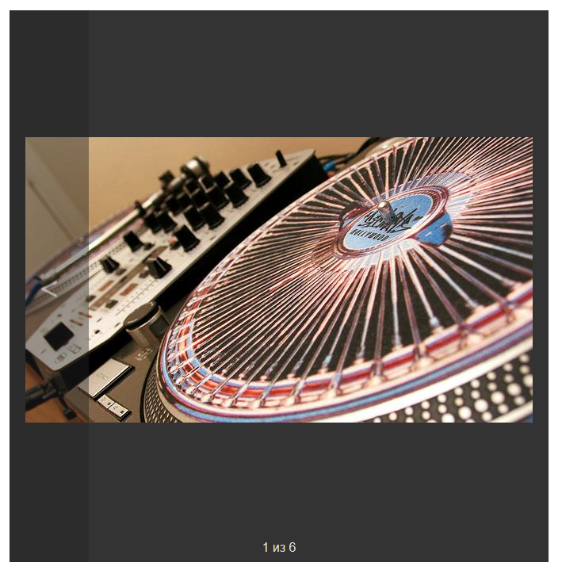

# SimpleSlider.js
This is the first JavaScript image slider implementation. Maybe I will complete this in the future.

## How to use it?
I don’t know myself. :\ 

This was homework, so I did not do it very well. Perhaps one day I will return to this project and make it many times better.
